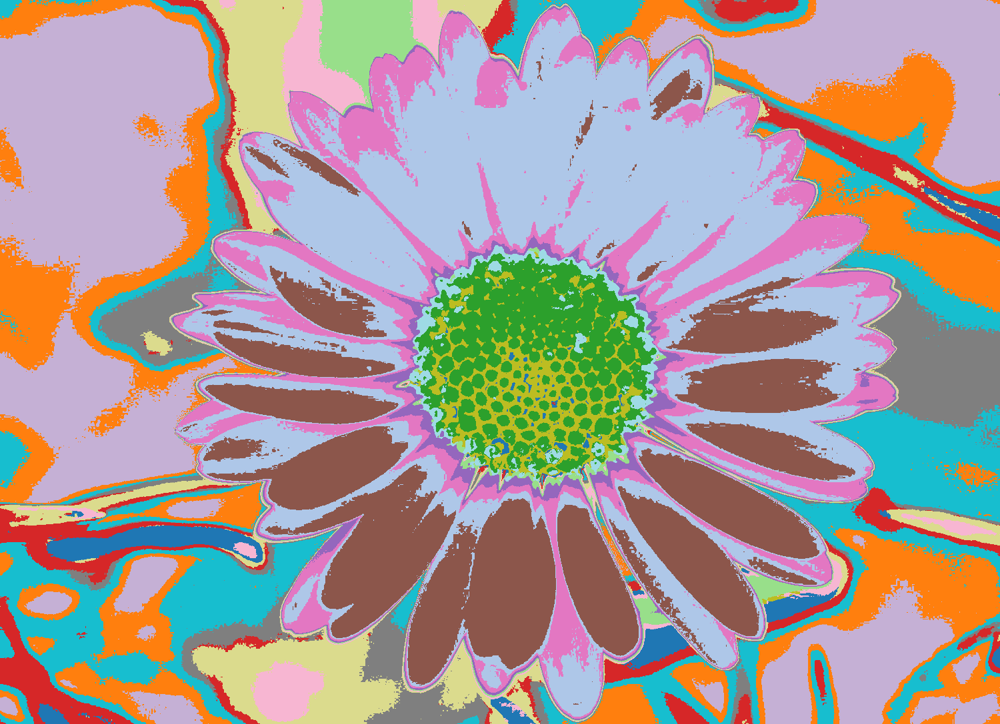
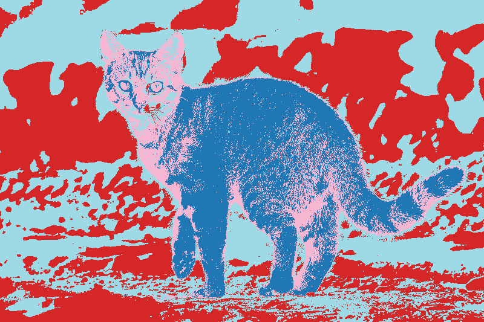
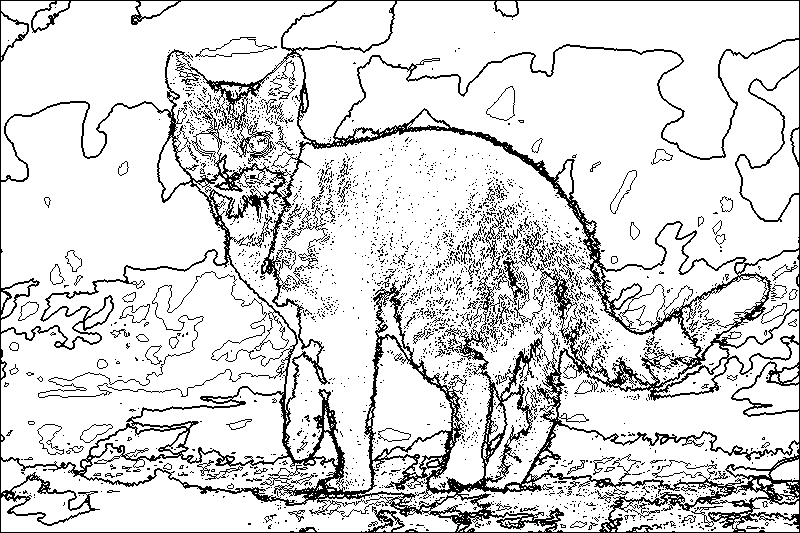
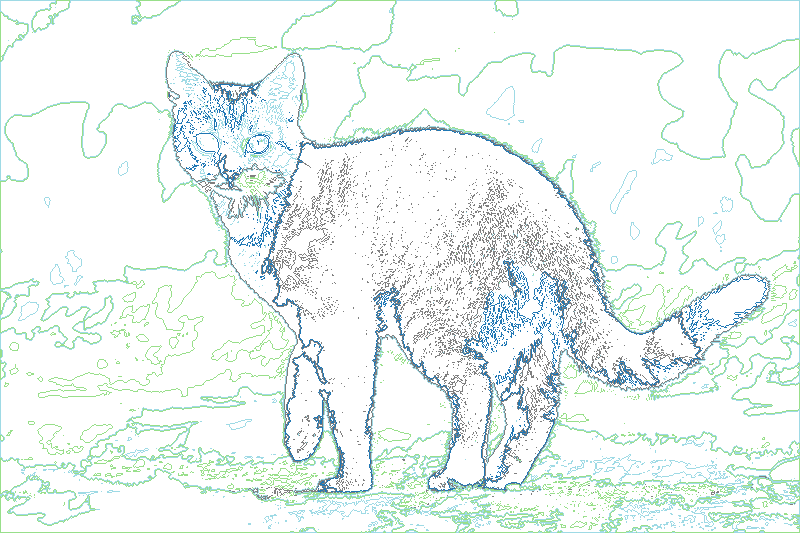
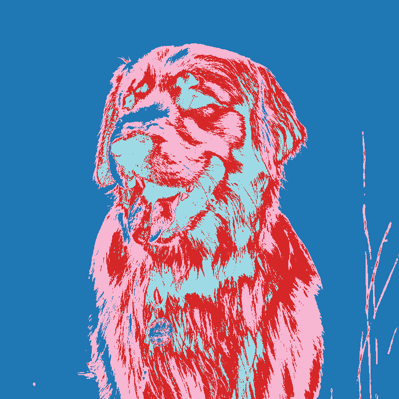
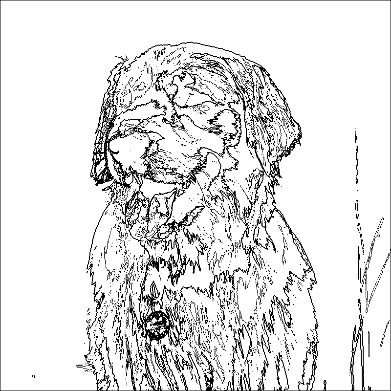
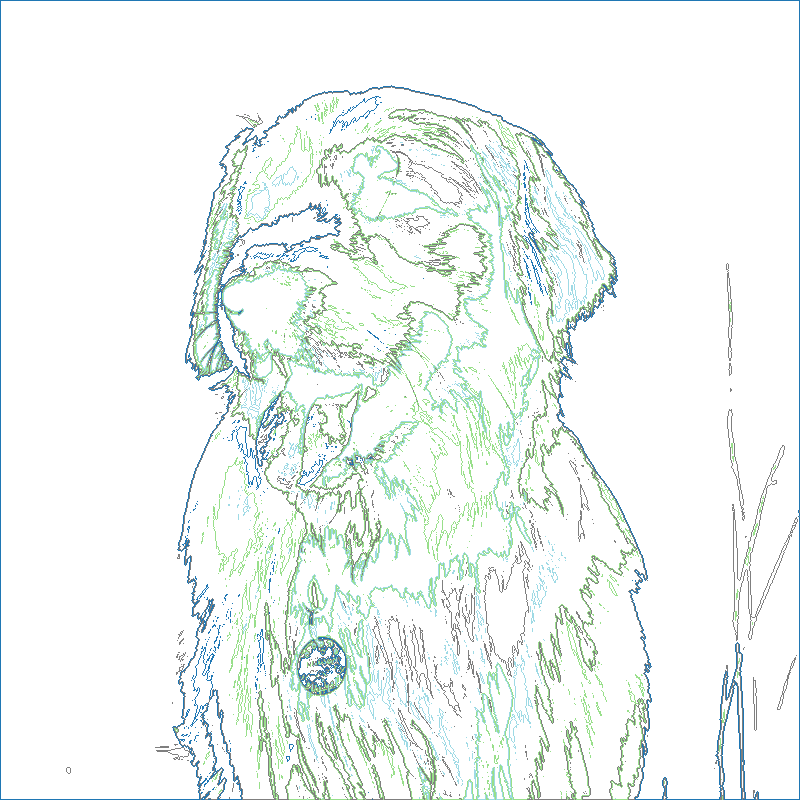

# Image Segmentation 

**Showcasing the Power of K-Means Clustering for Image Segmentation**

This project explores the utilization of K-Means clustering in image segmentation, demonstrating its capability to group pixels into distinct clusters and uncover patterns within images.

## Overview

Image segmentation is crucial for computer vision tasks, object recognition, and various applications requiring the identification and isolation of distinct visual elements within an image.

  
<strong>Introduction to Image Segmentation</strong>

  **Image segmentation** is a computer vision technique that involves partitioning an image into multiple segments or sets of pixels. The primary goal is to simplify the representation of an image or make it more meaningful for analysis. Each segment typically represents a distinct object or region in the image. The purpose of image segmentation is to extract useful information and facilitate more efficient analysis and interpretation of the visual content.

  ### Purposes of Image Segmentation:

  1. **Object Recognition and Identification:**
     - Segmentation helps identify and distinguish individual objects or regions within an image. This is crucial for various applications, such as object detection and tracking.

  2. **Scene Understanding:**
     - Breaking down an image into segments aids in understanding the overall scene composition. It allows for a more detailed analysis of the relationships between different objects or regions.

  3. **Image Editing and Enhancement:**
     - Segmentation is used in image editing applications to isolate specific objects or areas for manipulation. It enables targeted modifications, such as adjusting colors, applying filters, or removing unwanted elements.

  4. **Medical Imaging:**
     - In medical imaging, segmentation is used to identify and analyze specific structures within images, such as organs, tumors, or blood vessels. This information is vital for diagnostics and treatment planning.

  5. **Autonomous Vehicles:**
     - Image segmentation is employed in the field of autonomous vehicles for scene understanding and object detection. It helps the vehicle's computer vision system identify and classify objects on the road, such as pedestrians, vehicles, and obstacles.

  6. **Satellite Image Analysis:**
     - Satellite images often cover large geographical areas. Image segmentation is useful for extracting meaningful information, such as identifying land cover types, monitoring changes over time, and assessing environmental conditions.

  7. **Video Surveillance:**
     - Image segmentation is employed in video surveillance systems to detect and track objects or people within a video stream. It assists in identifying unusual activities or events.

  8. **Biometrics:**
     - Image segmentation is used in biometric systems for face recognition, fingerprint analysis, and other biometric identification processes. It helps isolate and analyze specific features for accurate identification.

  ### Techniques for Image Segmentation:

  - **Thresholding:**
    - Pixels are classified based on intensity values.

  - **Edge-Based Segmentation:**
    - Focuses on detecting boundaries or edges between different regions.

  - **Region-Based Segmentation:**
    - Groups pixels into regions based on certain criteria like color or texture similarity.

  - **Clustering Algorithms:**
    - Techniques like K-Means clustering group pixels with similar features.

  - **Deep Learning:**
    - Convolutional Neural Networks (CNNs) have shown remarkable success in semantic segmentation tasks.

  Image segmentation is a fundamental step in various image processing and computer vision applications, contributing to advancements in fields such as healthcare, automotive technology, agriculture, and more.

## Image Results

|  Original Image | ColorSegmentate | DrawContours | DrawContoursWithUniqueColors |
| --------------- | --------------- | ------------ | ----------------------------- |
|  |  |  |  |
|  |  |  |  |

## How it Works

#### Prerequisites
- Ensure you have the necessary dependencies installed, including `numpy`, `matplotlib`, `scikit-learn`, and `opencv-python`.

### The primary steps involve:

1. **Loading and Preprocessing**: The RGB values of an image are extracted, and the image is reshaped to facilitate clustering.

2. **K-Means Clustering**: The K-Means algorithm is applied to cluster similar pixels together. The number of clusters determines the level of segmentation.

3. **Visualization**: The segmented image is reconstructed using the cluster centers, showcasing the distinctive regions.

## Project Structure

1. `ColorSegmentate(filename, n_clusters)`:
    - **Description**: Segments an image with the specified number of clusters and saves the results in different formats.
    - **Purpose**: Detect segments of the image based on color.
    - **Method**: Utilizes K-Means clustering to group pixels with similar colors into distinct clusters.
    - **Output**: Generates a segmented image with unique colors assigned to different clusters.

2. `DrawContours(filename, n_clusters)`:
    - **Description**: Draws contours around clusters on the original image, enhancing visual separation.
    - **Purpose**: Detect the outlines or contours of the segments identified by ColorSegmentate.
    - **Method**: Uses contour detection on the segmented image to outline different regions.
    - **Output**: Produces an image with outlined contours.

3. `DrawContoursWithUniqueColors(filename, n_clusters)`:
    - **Description**: Incorporates unique colors for each cluster, providing a more visually appealing segmentation.
    - **Purpose**: Similar to DrawContours but assigns unique colors to the contours of different clusters.
    - **Method**: Combines contour detection with assigning unique colors to each cluster.
    - **Output**: Generates an image with contours outlined and each cluster represented by a distinct color.

## Acknowledgments

This project was inspired from this comprehensive tutorial on image segmentation:

[Image Segmentation with K-Means Clustering in Python](https://www.youtube.com/watch?v=X-Y91ddBqaQ)

## Author
Vladimir Balabanov ( **Grrr1337** )

## License
This project is licensed under the MIT License.

