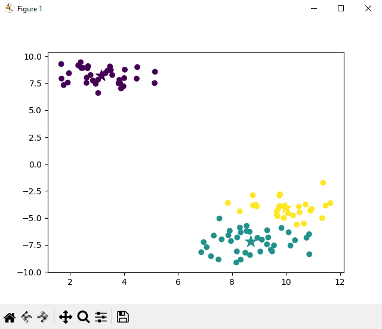
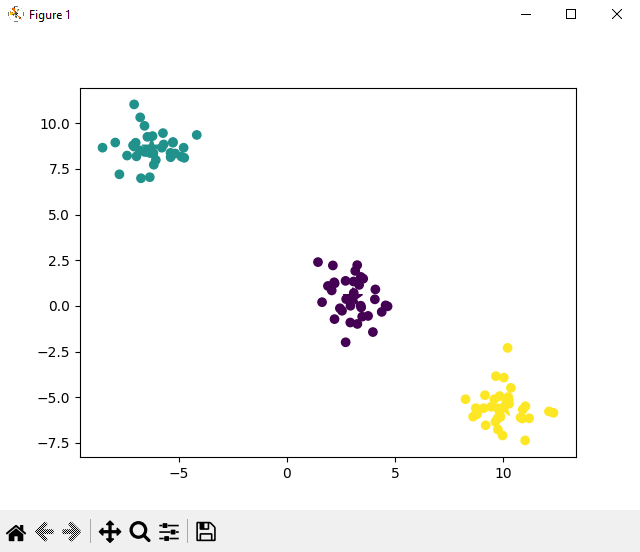
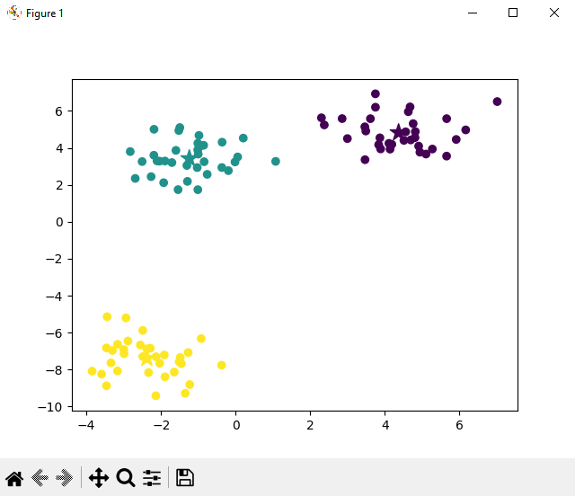

# K-Means Clustering

**K-Means Clustering From Scratch in Python (Mathematical)**

This is an implementation of the K-Means clustering algorithm from scratch in Python. The algorithm is used for unsupervised learning, particularly when dealing with unlabeled data, **to identify groups within the dataset**.


## Overview
K-means clustering is employed to find groups in data, with the number of groups represented by the `variable K`. This implementation **randomly initializes centroid points** and iteratively refines their positions to group data points effectively.

<details>
  <summary><strong>K-Means Clustering: An Overview</strong></summary>

  <br>

  **What is K-Means?**

  **K-Means** is a popular clustering algorithm used in unsupervised machine learning. **Clustering** is the process of grouping similar data points together based on certain features. In the case of K-Means, it divides a dataset into **K clusters**, where **K is a predefined number**. **Each cluster is represented by a centroid**, which is the average of all the data points in that cluster.

  **How does K-Means work?**

  1. **Initialization:** The algorithm begins by randomly selecting K data points as initial centroids.
  2. **Assignment:** Each data point is assigned to the nearest centroid, forming K clusters.
  3. **Update Centroids:** The centroids are recalculated as the mean of all data points assigned to that cluster.
  4. **Reassignment:** Steps 2 and 3 are repeated until the centroids no longer change significantly or a maximum number of iterations is reached.

  **Purpose and Applications:**

  1. **Data Segmentation:**
     - *Customer Segmentation:* Identify groups of customers with similar behaviors for targeted marketing.
     - *Image Segmentation:* Divide an image into regions with similar characteristics.

  2. **Anomaly Detection:**
     - Identify data points that do not conform to the overall pattern.

  3. **Compression:**
     - Representing data points with the index of their cluster centroid can reduce data storage.

  4. **Feature Engineering:**
     - K-Means can be used to create new features based on the cluster to which a data point belongs.

  5. **Genetic Clustering:**
     - Used in bioinformatics for classifying genes based on expression levels.

  **Key Considerations:**

  1. **Choice of K:**
     - Determining the optimal number of clusters is crucial. Techniques like the Elbow Method or Silhouette Analysis are often used.

  2. **Sensitive to Initial Centroids:**
     - The final clusters can depend on the initial choice of centroids. Multiple initializations are often performed, and the best result is chosen.

  3. **Assumes Spherical Clusters:**
     - K-Means works well when clusters are roughly spherical. It may struggle with elongated or irregular-shaped clusters.


</details>


## Screenshots







### Choosing the Correct "K" Value
Note that there are strategies for choosing the correct "K" value, but it is not covered within the scope of this tutorial.

## Usage

### Prerequisites
Ensure you have the required Python libraries installed:

```bash
pip install numpy matplotlib scikit-learn
```


## How it Works

#### KMeansClustering Class
- The `KMeansClustering` class is implemented for the K-Means algorithm, allowing clustering on given data points.
- The `euclidean_distance` method calculates the Euclidean distance between a data point and centroids.
#### fit Method
- The `fit` method initializes centroid points, assigns data points to clusters, and iteratively updates centroids to optimize cluster assignment.
#### main
- The function generates sample data using `make_blobs`, applies the K-Means clustering algorithm, and visualizes the results. It also calculates the Adjusted Rand Index (ARI) to evaluate the clustering performance.

## Acknowledgements
The implementation follows the tutorial available on YouTube: [K-Means Clustering From Scratch in Python](https://www.youtube.com/watch?v=5w5iUbTlpMQ)

## Author
Vladimir Balabanov ( **Grrr1337** )

## License
This project is licensed under the MIT License.

