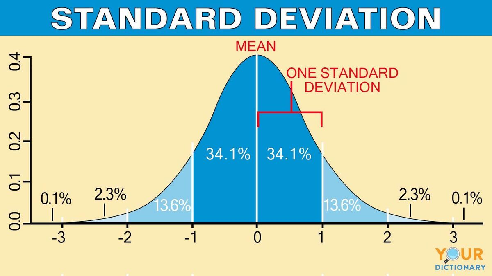

# Statistics Fundamentals in Python

This Python script demonstrates basic statistical calculations using the `statistics` and `math` modules. The code includes functions for calculating `mean`, `median`, `mode`, `standard deviation`, `pvariance`, `pstdev`, and `harmonic mean`. It also compares manual calculations with the built-in functions.

<details>
  <summary>Statistical Calculations</summary>

  ### Mean

  The mean, or average, is the sum of all values in a dataset divided by the number of values. It provides a measure of the central tendency of the data.

  ### Median

  The median is the middle value of a dataset when it is sorted in ascending or descending order. It is less sensitive to outliers than the mean, making it a robust measure of central tendency.

  ### Mode

  The mode is the value that appears most frequently in a dataset. A dataset may have one mode, more than one mode, or no mode at all.

  ### Standard Deviation

  Standard deviation measures the amount of variation or dispersion in a set of values. A low standard deviation indicates that the values are close to the mean, while a high standard deviation indicates greater variability.

  ### Pvariance

  Population variance is a measure of how spread out the values in a population are. It is calculated as the average of the squared differences from the mean.

  ### Pstdev

  Population standard deviation is the square root of the population variance. It provides a standardized measure of the spread of values in a population.

  ### Harmonic Mean

  The harmonic mean is the reciprocal of the arithmetic mean of the reciprocals of a set of values. It tends to emphasize the impact of smaller values in the dataset and is particularly useful for rates or ratios.

  ### Manual Calculations vs. Built-in Functions

  The script includes both manual calculations and the use of built-in functions from the `statistics` and `math` modules. Comparing these results helps verify the accuracy of the built-in functions and provides insight into the underlying calculations.

</details>



## Prerequisites

Make sure you have Python installed on your machine.

## Usage

1. Clone the repository:

   ```bash
   git clone https://github.com/Grrr1337/Statistics-Fundamentals.git
   ```

2. Navigate to the project directory:
    ```bash
    cd statistics-fundamentals-python
    ```

3. Run the script:
    ```bash
    python statistics_demo.py
    ```

## Tests
The script includes multiple test cases to showcase different scenarios. You can explore these by uncommenting the relevant test functions in the ```if __name__ == '__main__':``` block.
 
## Contributing
Feel free to contribute to this project by opening issues or submitting pull requests.

## Author
Vladimir Balabanov ( **Grrr1337** )

## License
This project is licensed under the MIT License.


